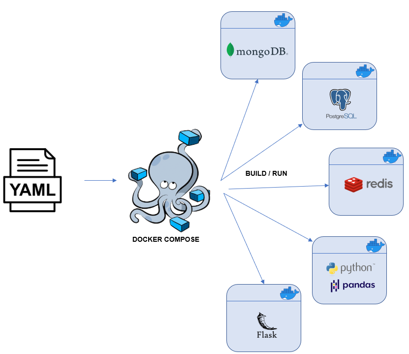

# Nodejs - Ai with Docker Compose

The project demonstrates my work capabailites in Backend with Nodejs and Docker compose features ,
The Project also explains the Microservice architecture of the docker for large applications , where each component serves as a standalone service that interact with each other

## Project Details:

the backend is about an e-commerce app where basic CRUD operations can be done using node js , MongoDB and Express , also integrating an AI model which classify user comments to be toxic or not (the comment and the classification result is also added under this user account in the database for further analysis and work)

# Demo:

---

